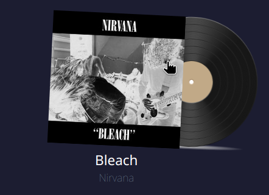
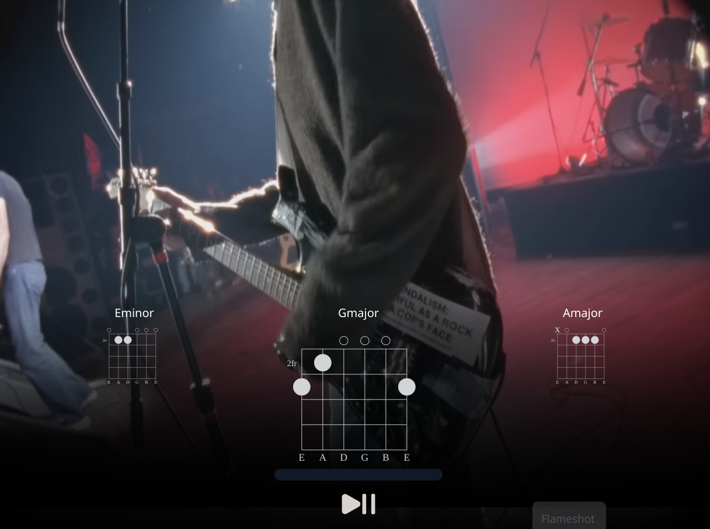

# Free Jam

Project started with the goal to help beginner guitar players to improve their playing and learn new songs. Users can select an album and choose which song they want to learn. The song is then played the chords and timings are displayed on screen.




## Setup

- Frontend is made in React (typescript)
- Backend is made in .NET 7
- At first launch, the docker compose will insert some test data
- Album covers are stored in a S3 bucket
- Data about the albums is stored in a MSSQL database
- A reverse proxy is used to allow access to the above mentioned tools
  - /bucket for access to the images
  - /dev/bucket for access to the UI for the S3 bucket
  - frontend is available at root (localhost)

> **_NOTE:_** The backend is currently not included in docker compose due to some issues with dotnet watch. Run the backend seperately with dotnet watch
> 
```bash
docker compose up -d
```

TODO:
- Song Editor
- Responsiveness is average
- Fix dotnet watch in docker compose