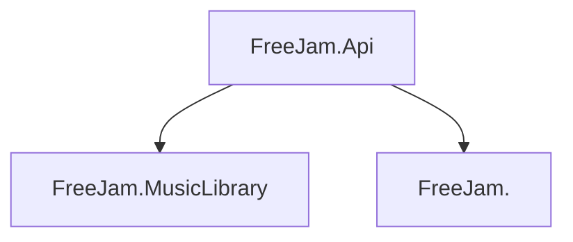

# Free Jam

## FreeJam Solution

### FreeJam.Api
Hosts main api

### FreeJam.MusicLibrary
Contains interface for data relating to music theory such as guitar chords, instruments etc.

### FreeJam.SongMapper
Interface for storing and managing song mappings

### (future) FreeJam.Identity
Users, roles and rights